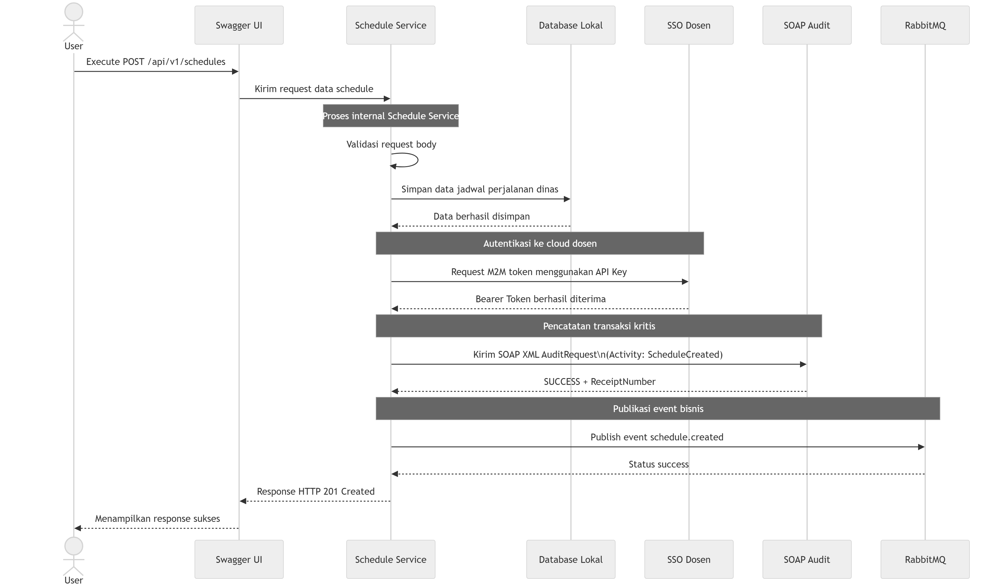

# Analisis Tugas 3 – Schedule Service

## Identitas Schedule Service

Pada Tugas Besar mata kuliah Integrasi Aplikasi Enterprise, saya mengerjakan bagian Schedule-Service dengan resource utama schedules. Service ini berada pada proses bisnis Penugasan Perjalanan Dinas (Dispatching). Secara sederhana, service ini bertugas membuat data penjadwalan kendaraan dan driver yang akan digunakan dalam perjalanan dinas.

Pada Tugas 2, service masih berfokus pada implementasi REST API, Swagger, GraphQL, API Key, dan pengelolaan data jadwal perjalanan dinas. Pada Tugas 3, service dikembangkan lebih lanjut agar dapat terintegrasi dengan layanan pusat yang disediakan dosen, yaitu SSO sebagai penyedia token, SOAP/XML untuk audit transaksi, dan RabbitMQ sebagai message broker untuk menyebarkan event bisnis. URL layanan pusat yang digunakan adalah:

https://iae-sso.virtualfri.id

## 1. Transaksi Kritis

Transaksi kritis pada Schedule Service adalah proses pembuatan jadwal perjalanan dinas (**ScheduleCreated**) melalui endpoint:

POST /api/v1/schedules

Transaksi ini dipilih karena proses tersebut merupakan awal dari aktivitas dispatching, yaitu menentukan kendaraan dan driver yang akan digunakan pada suatu perjalanan dinas. Pada tahap ini sistem mencatat informasi penting seperti schedule ID, vehicle ID, driver ID, tujuan perjalanan, tujuan penggunaan kendaraan, serta status jadwal.

Karena transaksi ini bersifat state-changing dan menjadi dasar proses bisnis berikutnya, aktivitas tersebut perlu dicatat pada sistem audit melalui activity name **ScheduleCreated** dan dipublikasikan sebagai event **schedule.created** agar dapat diketahui oleh service lain.

## 2. Justifikasi Transaksi Kritis

Transaksi pembuatan jadwal perjalanan dinas dinilai kritis karena:

* Berhubungan langsung dengan proses dispatching kendaraan.
* Menentukan kendaraan dan driver yang akan digunakan.
* Menjadi dasar aktivitas operasional berikutnya.
* Menghasilkan informasi penting yang perlu ditelusuri.
* Perlu dicatat ke sistem audit.
* Perlu dipublikasikan sebagai event agar service lain mengetahui bahwa jadwal baru telah dibuat.

Berdasarkan alasan tersebut, endpoint POST /api/v1/schedules dipilih sebagai transaksi utama yang diintegrasikan dengan layanan cloud dosen.

## 3. Integrasi dengan SSO

Schedule Service menggunakan layanan Single Sign-On (SSO) yang disediakan oleh dosen untuk memperoleh token yang digunakan dalam mengakses layanan cloud.

Token diperoleh melalui endpoint:

POST https://iae-sso.virtualfri.id/api/v1/auth/token

menggunakan API Key yang diberikan melalui LMS. Berdasarkan referensi API yang disediakan dosen, endpoint tersebut digunakan untuk memperoleh token Machine-to-Machine (M2M).

Pada implementasi ini, Schedule Service menggunakan grant type:

client_credentials

Token yang diperoleh kemudian digunakan sebagai Bearer Token untuk mengakses layanan SOAP Audit dan RabbitMQ Publisher.

Konfigurasi layanan cloud disimpan pada file .env dan dipanggil melalui config/services.php agar informasi seperti base URL, API Key, Team ID, dan exchange tidak ditulis langsung di dalam controller.

Contoh konfigurasi yang digunakan:

IAE_CLOUD_URL=https://iae-sso.virtualfri.id

IAE_EXCHANGE=iae.central.exchange

Dengan mekanisme tersebut, Schedule Service dapat melakukan autentikasi terhadap layanan cloud dosen secara terpusat sebelum melakukan pencatatan transaksi ke SOAP Audit dan publikasi event ke RabbitMQ.

## 4. Integrasi dengan SOAP Audit

Pada transaksi kritis ScheduleCreated melalui endpoint:

POST /api/v1/schedules

data jadwal perjalanan dinas yang berhasil dibuat akan dikirim ke layanan SOAP Audit yang disediakan dosen.

Data transaksi dikirim dalam format SOAP XML Envelope, dengan informasi transaksi dimasukkan ke dalam tag <LogContent> dalam bentuk CDATA JSON. Berdasarkan referensi dari dosen, tag yang wajib digunakan adalah <TeamID>, <ActivityName>, dan <LogContent>.

Activity name yang digunakan adalah:

ScheduleCreated

Contoh data yang dikirim ke SOAP Audit adalah:

{
  "schedule_id": 13,
  "vehicle_id": 911,
  "driver_id": 139,
  "destination": "Bandung",
  "purpose": "Kunjungan Dinas",
  "status": "Scheduled"
}

Data tersebut dikirim melalui SOAP XML Envelope dengan Team ID:

TEAM-07

Jika proses audit berhasil, sistem SOAP akan mengembalikan status:

SUCCESS

beserta receipt number sebagai bukti bahwa transaksi berhasil dicatat pada sistem audit dosen.

Pada hasil pengujian, SOAP Audit berhasil mengembalikan status sukses dan menghasilkan receipt number. Hal ini menunjukkan bahwa transaksi penjadwalan perjalanan dinas berhasil tercatat pada sistem audit pusat.

## 5. Integrasi dengan RabbitMQ

Setelah data jadwal perjalanan dinas berhasil dibuat, Schedule Service juga mengirimkan event ke RabbitMQ melalui endpoint publish yang disediakan oleh cloud dosen.

Event yang digunakan adalah:

schedule.created

Event ini digunakan untuk memberi tahu sistem lain bahwa data penjadwalan perjalanan dinas baru telah dibuat. Payload event berisi informasi seperti team ID, service name, event name, serta data schedule yang berhasil dibuat.

Pada hasil pengujian melalui Postman, RabbitMQ berhasil mengembalikan status:

success

Artinya, event schedule.created berhasil dipublikasikan ke cloud dosen melalui exchange iae.central.exchange. Pada dashboard RabbitMQ dosen, event yang dikirim oleh Schedule Service berhasil muncul sehingga menunjukkan bahwa proses publish event telah berjalan dengan baik.

## 6. Alur Integrasi Sistem

Alur integrasi pada Schedule Service adalah sebagai berikut:

1. User menjalankan endpoint POST /api/v1/schedules melalui Swagger UI.
2. Swagger UI mengirim request data schedule ke Schedule Service.
3. Schedule Service melakukan validasi terhadap request body yang diterima.
4. Data jadwal perjalanan dinas disimpan ke database lokal.
5. Database lokal mengembalikan informasi bahwa data berhasil disimpan.
6. Schedule Service melakukan autentikasi ke layanan cloud dosen dengan meminta token M2M menggunakan API Key.
7. Layanan SSO dosen mengembalikan Bearer Token yang akan digunakan untuk mengakses layanan terpusat lainnya.
8. Schedule Service mengirim data transaksi ke layanan SOAP Audit dalam bentuk SOAP XML AuditRequest dengan activity ScheduleCreated.
9. Layanan SOAP Audit mengembalikan status SUCCESS beserta receipt number sebagai bukti bahwa transaksi berhasil dicatat pada sistem audit dosen.
10. Schedule Service mempublikasikan event schedule.created ke RabbitMQ melalui endpoint publish yang disediakan oleh cloud dosen.
11. RabbitMQ mengembalikan status success yang menandakan bahwa event berhasil dipublikasikan.
12. Schedule Service mengembalikan response HTTP 201 Created kepada Swagger UI.
13. Swagger UI menampilkan response sukses kepada user.

## 7. Sequence Diagram

Berikut adalah sequence diagram transaksi kritis pada Schedule Service mulai dari eksekusi endpoint POST /api/v1/schedules, penyimpanan data ke database lokal, pengambilan token M2M, pengiriman SOAP Audit, hingga publikasi event ke RabbitMQ.

## 8. Implementasi pada Laravel

Integrasi dengan layanan cloud dosen dibuat melalui file:

app/Services/IaeCloudService.php

File tersebut berisi fungsi untuk:

- Mengambil token Machine-to-Machine (M2M) dari layanan SSO dosen.
- Mengirim data transaksi ke layanan SOAP Audit.
- Mempublikasikan event bisnis ke RabbitMQ.

Pada controller utama:

app/Http/Controllers/Api/V1/ScheduleController.php

fungsi `store()` diperbarui sehingga setelah data schedule berhasil dibuat dan disimpan ke database lokal, sistem secara otomatis akan:

- Mengirim data transaksi ke SOAP Audit dengan activity `ScheduleCreated`.
- Mempublikasikan event `schedule.created` ke RabbitMQ.

Dengan demikian, integrasi dengan layanan cloud dosen tidak hanya diuji secara manual melalui Postman, tetapi juga dijalankan secara otomatis ketika endpoint:

POST /api/v1/schedules

dieksekusi melalui Swagger UI.

## 9. Hasil Pengujian

Pengujian dilakukan melalui Swagger UI pada endpoint:

POST /api/v1/schedules

Hasil pengujian menunjukkan bahwa data schedule berhasil dibuat, SOAP Audit berhasil mengembalikan status sukses beserta receipt number, dan RabbitMQ berhasil mempublikasikan event dengan status success.

Selain itu, event yang dipublikasikan juga berhasil muncul pada dashboard RabbitMQ dosen. Hal ini menunjukkan bahwa Schedule Service telah berhasil terintegrasi dengan layanan SSO, SOAP Audit, dan RabbitMQ sesuai dengan kebutuhan pada Tugas 3.

## 10. Catatan Team ID

Selama proses integrasi ditemukan bahwa token Machine-to-Machine (M2M) yang diterbitkan oleh layanan SSO dosen masih mengembalikan identitas TEAM-06, sedangkan kelompok saya yang mengerjakan Schedule Service merupakan TEAM-07.

Akibatnya, dashboard RabbitMQ menampilkan identitas pengirim sebagai TEAM-06. Namun demikian, payload event yang dikirim oleh Schedule Service tetap menggunakan atribut team_id dengan nilai TEAM-07 sesuai dengan konfigurasi yang digunakan pada implementasi.

Perbedaan tersebut diduga berasal dari identitas yang terasosiasi pada token M2M yang diterbitkan oleh layanan SSO pusat dan tidak memengaruhi keberhasilan proses integrasi. Hal ini dibuktikan dengan berhasilnya proses SOAP Audit dan publikasi event ke RabbitMQ yang ditandai dengan status success serta munculnya event pada dashboard dosen.

## Kesimpulan

Schedule Service berhasil diintegrasikan dengan layanan cloud dosen melalui mekanisme SSO, SOAP Audit, dan RabbitMQ.

Transaksi kritis yang digunakan pada service ini adalah proses pembuatan jadwal perjalanan dinas (**ScheduleCreated**) melalui endpoint:

POST /api/v1/schedules

Ketika endpoint tersebut dieksekusi melalui Swagger UI, Schedule Service berhasil menyimpan data ke database lokal, mencatat aktivitas transaksi ke layanan SOAP Audit dengan activity ScheduleCreated, serta mempublikasikan event schedule.created ke RabbitMQ.

Dengan demikian, Schedule Service telah memenuhi kebutuhan integrasi pada Tugas 3, yaitu terhubung dengan layanan SSO dosen, melakukan pencatatan transaksi kritis melalui SOAP Audit, dan menyebarkan event bisnis melalui RabbitMQ.
